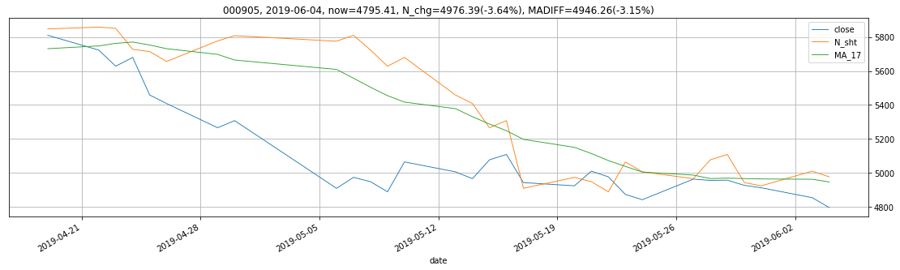
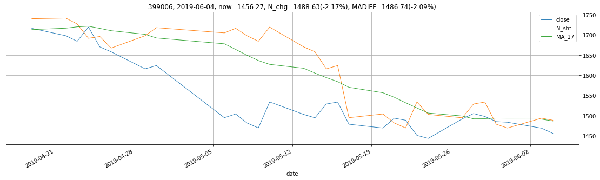
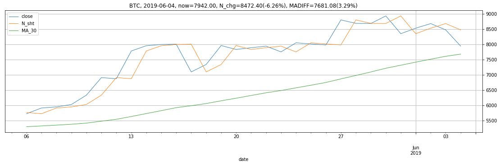
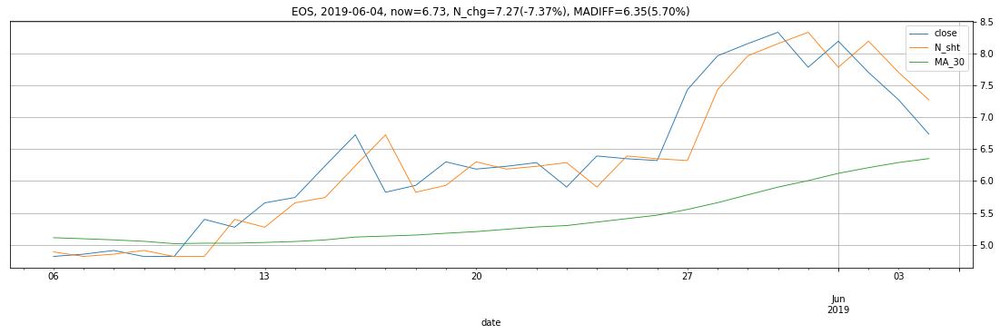
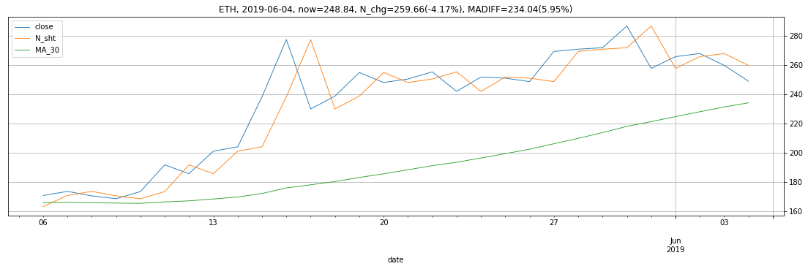
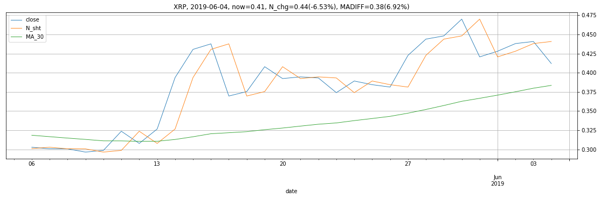
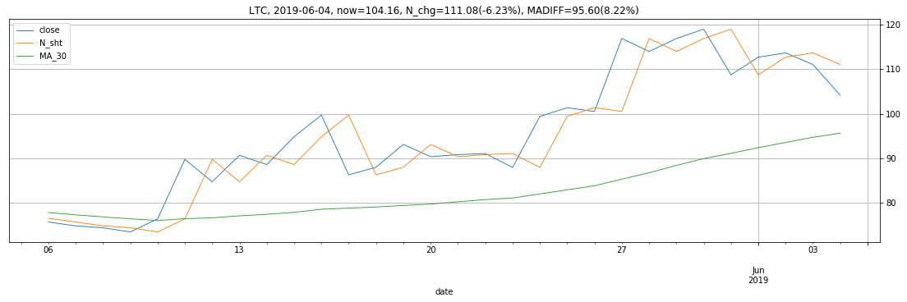

```python
import pandas as pd
pd.core.common.is_list_like = pd.api.types.is_list_like

from IPython.core.interactiveshell import InteractiveShell
InteractiveShell.ast_node_interactivity = 'all'

from pandas_highcharts.core import serialize
from pandas_highcharts.display import display_charts

import matplotlib
import matplotlib.pyplot as plt

from IPython.core.display import display, HTML
display(HTML("<style>.container { width:70% !important; }</style>"))
```


<script src="https://code.jquery.com/jquery-3.1.1.min.js"></script>
<script src="https://code.highcharts.com/stock/highstock.js"></script>
<script src="https://code.highcharts.com/stock/modules/exporting.js"></script>
<script src="https://code.highcharts.com/stock/modules/export-data.js"></script>


<style>.container { width:70% !important; }</style>


```python
%%capture
%run -t monitor_daily_rotation.ipynb
```


```python
%store -r MONITOR_TARGET
%store -r stock_df_dict
```


```python
monitor_df = pd.DataFrame(columns=['SYMBOL', 'DATE', 'CLOSE'])

for symbol in MONITOR_TARGET:
    df = stock_df_dict[symbol].iloc[-30:].copy()
    
    df.reset_index(drop=False, inplace=True)
    df['date'] = df['date'].apply(lambda x: x.to_timestamp().to_datetime64())
    df.set_index('date', inplace=True)
    
    today_market = df.iloc[-1]
    now_point = today_market.close
    for col in df.columns:
        if 'ROLLINGMAX' in col:
            buy_point = today_market[col]
            buy_diff = (buy_point - now_point) / now_point * 100
        elif 'ROLLINGMIN' in col:
            sell_point = today_market[col]
            sell_diff = (now_point - sell_point) / now_point * 100
        elif 'MA' in col:
            ma = today_market[col]
            ma_diff = (now_point - ma) / now_point * 100
        elif 'N_chg' in col:
            n_chg = today_market[col] * 100
    
    monitor_df = monitor_df.append({
        'SYMBOL': symbol, 
        'DATE': today_market.name.date(), 
        'CLOSE': now_point, 
        'MA': ma,
        'MADIFF': '%.2f%%' % ma_diff,
        'N_sht': today_market.N_sht, 
        'N_chg': '%.2f%%' % n_chg,
    }, ignore_index=True)
    
    title = '%s, %s, now=%.2f, N_chg=%.2f(%.2f%%), MADIFF=%.2f(%.2f%%)' % \
        (symbol, today_market.name.date(), now_point, today_market.N_sht, n_chg, ma, ma_diff)
    
    df.drop(columns=['N_chg'], inplace=True)
    ax = df.plot(kind='line', title=title, linewidth=0.9, grid=True, figsize=(19, 5))
    ax.yaxis.tick_right()
    
#     display_charts(df, chart_type='stock', kind='line', title=title, figsize=(1000, 600))

monitor_df
```


<div>
<style scoped>
    .dataframe tbody tr th:only-of-type {
        vertical-align: middle;
    }

    .dataframe tbody tr th {
        vertical-align: top;
    }

    .dataframe thead th {
        text-align: right;
    }
</style>
<table border="1" class="dataframe">
  <thead>
    <tr style="text-align: right;">
      <th></th>
      <th>SYMBOL</th>
      <th>DATE</th>
      <th>CLOSE</th>
      <th>MA</th>
      <th>MADIFF</th>
      <th>N_chg</th>
      <th>N_sht</th>
    </tr>
  </thead>
  <tbody>
    <tr>
      <th>0</th>
      <td>399300</td>
      <td>2019-06-04</td>
      <td>3598.470</td>
      <td>3648.254706</td>
      <td>-1.38%</td>
      <td>-1.40%</td>
      <td>3649.3800</td>
    </tr>
    <tr>
      <th>1</th>
      <td>000905</td>
      <td>2019-06-04</td>
      <td>4795.410</td>
      <td>4946.261176</td>
      <td>-3.15%</td>
      <td>-3.64%</td>
      <td>4976.3900</td>
    </tr>
    <tr>
      <th>2</th>
      <td>399006</td>
      <td>2019-06-04</td>
      <td>1456.270</td>
      <td>1486.739412</td>
      <td>-2.09%</td>
      <td>-2.17%</td>
      <td>1488.6300</td>
    </tr>
    <tr>
      <th>3</th>
      <td>BTC</td>
      <td>2019-06-04</td>
      <td>7942.000</td>
      <td>7681.076667</td>
      <td>3.29%</td>
      <td>-6.26%</td>
      <td>8472.4000</td>
    </tr>
    <tr>
      <th>4</th>
      <td>EOS</td>
      <td>2019-06-04</td>
      <td>6.734</td>
      <td>6.350367</td>
      <td>5.70%</td>
      <td>-7.37%</td>
      <td>7.2700</td>
    </tr>
    <tr>
      <th>5</th>
      <td>ETH</td>
      <td>2019-06-04</td>
      <td>248.840</td>
      <td>234.040000</td>
      <td>5.95%</td>
      <td>-4.17%</td>
      <td>259.6600</td>
    </tr>
    <tr>
      <th>6</th>
      <td>XRP</td>
      <td>2019-06-04</td>
      <td>0.412</td>
      <td>0.383503</td>
      <td>6.92%</td>
      <td>-6.53%</td>
      <td>0.4408</td>
    </tr>
    <tr>
      <th>7</th>
      <td>LTC</td>
      <td>2019-06-04</td>
      <td>104.160</td>
      <td>95.597667</td>
      <td>8.22%</td>
      <td>-6.23%</td>
      <td>111.0800</td>
    </tr>
  </tbody>
</table>
</div>






















