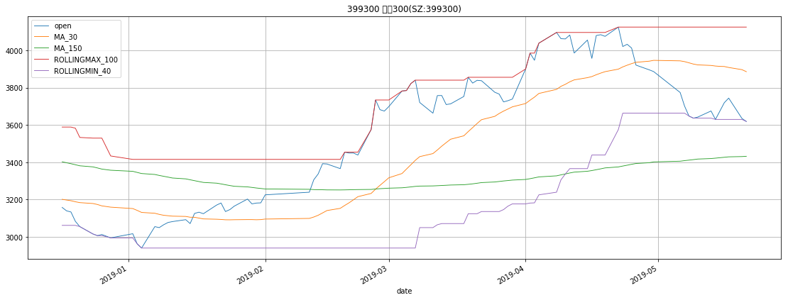

```python
import pandas as pd
pd.core.common.is_list_like = pd.api.types.is_list_like

from IPython.core.interactiveshell import InteractiveShell
InteractiveShell.ast_node_interactivity = 'all'

from pandas_highcharts.core import serialize
from pandas_highcharts.display import display_charts

import matplotlib
import matplotlib.pyplot as plt

from IPython.core.display import display, HTML
display(HTML("<style>.container { width:70% !important; }</style>"))
```


<script src="https://code.jquery.com/jquery-3.1.1.min.js"></script>
<script src="https://code.highcharts.com/stock/highstock.js"></script>
<script src="https://code.highcharts.com/stock/modules/exporting.js"></script>
<script src="https://code.highcharts.com/stock/modules/export-data.js"></script>


<style>.container { width:70% !important; }</style>


```python
%store -r MONITOR_TARGET
%store -r stock_df_dict
```


```python
for symbol in MONITOR_TARGET:
    df = stock_df_dict[symbol].iloc[-100:].copy()    
    df.reset_index(drop=False, inplace=True)
    # df = df.astype(dtype={'date': 'datetime64[ns]'})
    df['date'] = df['date'].apply(lambda x: x.to_timestamp().to_datetime64())
    df.set_index('date', inplace=True)

    title = '%s %s' % (symbol, MONITOR_TARGET[symbol]['NAME'])
    
#     display_charts(df, chart_type='stock', kind='line', title=title, figsize=(1000, 600))
    ax = df.plot(kind='line', title=title, linewidth=0.9, grid=True, figsize=(19, 7))
```





