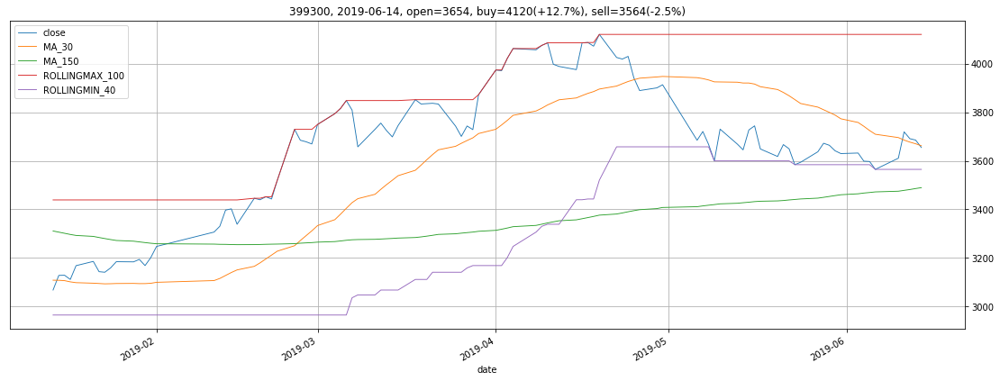
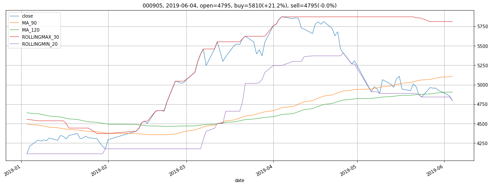
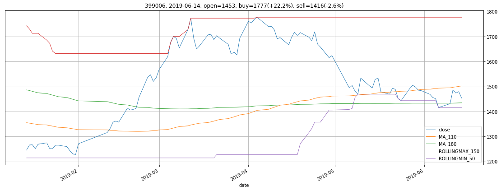

```python
import pandas as pd
pd.core.common.is_list_like = pd.api.types.is_list_like

from IPython.core.interactiveshell import InteractiveShell
InteractiveShell.ast_node_interactivity = 'all'

from pandas_highcharts.core import serialize
from pandas_highcharts.display import display_charts

import matplotlib
import matplotlib.pyplot as plt

from IPython.core.display import display, HTML
display(HTML("<style>.container { width:70% !important; }</style>"))
```


<script src="https://code.jquery.com/jquery-3.1.1.min.js"></script>
<script src="https://code.highcharts.com/stock/highstock.js"></script>
<script src="https://code.highcharts.com/stock/modules/exporting.js"></script>
<script src="https://code.highcharts.com/stock/modules/export-data.js"></script>


<style>.container { width:70% !important; }</style>


```python
%%capture
%run -t monitor_daily.ipynb
```


```python
%store -r MONITOR_TARGET
%store -r stock_df_dict
```


```python
monitor_df = pd.DataFrame(columns=['SYMBOL', 'DATE', 'NOW', 'BUY', 'BUYDIFF', 'SELL', 'SELLDIFF'])

for symbol in MONITOR_TARGET:
    df = stock_df_dict[symbol].iloc[-100:].copy()    
    df.reset_index(drop=False, inplace=True)
    # df = df.astype(dtype={'date': 'datetime64[ns]'})
    df['date'] = df['date'].apply(lambda x: x.to_timestamp().to_datetime64())
    df.set_index('date', inplace=True)

    today_market = df.iloc[-1]
    now_point = today_market.close
    for col in df.columns:
        if 'ROLLINGMAX' in col:
            buy_point = today_market[col]
            buy_diff = (buy_point - now_point) / now_point * 100
        elif 'ROLLINGMIN' in col:
            sell_point = today_market[col]
            sell_diff = (now_point - sell_point) / now_point * 100
    
    monitor_df = monitor_df.append({
        'SYMBOL': symbol, 
        'DATE': today_market.name.date(), 
        'NOW': now_point, 
        'BUY': buy_point, 
        'BUYDIFF': '+%.2f%%' % buy_diff, 
        'SELL': sell_point, 
        'SELLDIFF': '-%.2f%%' % sell_diff,
    }, ignore_index=True)
    
    title = '%s, %s, open=%d, buy=%d(+%.1f%%), sell=%d(-%.1f%%)' % \
        (symbol, today_market.name.date(), now_point, buy_point, buy_diff, sell_point, sell_diff)
#     display_charts(df, chart_type='stock', kind='line', title=title, figsize=(1000, 600))
    ax = df.plot(kind='line', title=title, linewidth=0.9, grid=True, figsize=(19, 7))
    ax.yaxis.tick_right()
    
monitor_df
```


<div>
<style scoped>
    .dataframe tbody tr th:only-of-type {
        vertical-align: middle;
    }

    .dataframe tbody tr th {
        vertical-align: top;
    }

    .dataframe thead th {
        text-align: right;
    }
</style>
<table border="1" class="dataframe">
  <thead>
    <tr style="text-align: right;">
      <th></th>
      <th>SYMBOL</th>
      <th>DATE</th>
      <th>NOW</th>
      <th>BUY</th>
      <th>BUYDIFF</th>
      <th>SELL</th>
      <th>SELLDIFF</th>
    </tr>
  </thead>
  <tbody>
    <tr>
      <th>0</th>
      <td>399300</td>
      <td>2019-06-04</td>
      <td>3598.47</td>
      <td>4120.61</td>
      <td>+14.51%</td>
      <td>3583.96</td>
      <td>-0.40%</td>
    </tr>
    <tr>
      <th>1</th>
      <td>000905</td>
      <td>2019-06-04</td>
      <td>4795.41</td>
      <td>5810.18</td>
      <td>+21.16%</td>
      <td>4795.41</td>
      <td>-0.00%</td>
    </tr>
    <tr>
      <th>2</th>
      <td>399006</td>
      <td>2019-06-04</td>
      <td>1456.27</td>
      <td>1777.26</td>
      <td>+22.04%</td>
      <td>1443.75</td>
      <td>-0.86%</td>
    </tr>
  </tbody>
</table>
</div>










